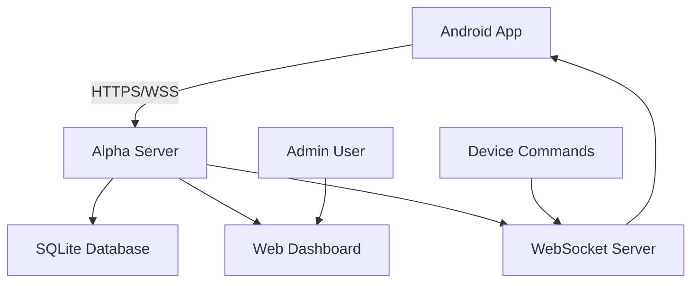

# 🛡️ Alpha Security Server

<div align="center">


**Professional Anti-Theft Server for Remote Device Management**

*Secure • Scalable • Real-time • Production-Ready*

[📖 Documentation](#documentation) • [🚀 Quick Start](#quick-start) • [🌐 Deploy](#deployment) • [📱 Android App](../app) • [🛠️ API](#api-reference)

</div>

---

## 📋 Overview

Alpha Security Server is a robust, production-ready backend system designed for remote device management and anti-theft protection. Built with Node.js and Express, it provides real-time device tracking, remote control capabilities, and a comprehensive dashboard for monitoring multiple devices.

### ✨ Key Features

- 🔐 **Secure Authentication** - JWT-based auth with bcrypt password hashing
- 📍 **Real-time Location Tracking** - GPS coordinate collection and mapping
- 🚨 **Remote Device Control** - Lock, alarm, locate, and wipe commands
- 🌐 **Web Dashboard** - Beautiful, responsive admin interface
- ⚡ **WebSocket Support** - Real-time updates and notifications  
- 🛡️ **Security First** - Rate limiting, CORS, helmet security headers
- 📊 **Health Monitoring** - Built-in health checks and metrics
- 🐳 **Docker Ready** - Containerized deployment with docker-compose
- 📱 **Mobile API** - RESTful API for Android/iOS integration
- 🔄 **Auto-Backup** - Automated database backups

---

## 🏗️ Architecture



### Tech Stack

- **Backend:** Node.js, Express.js
- **Database:** SQLite (production-ready with PostgreSQL support)
- **Real-time:** Socket.IO WebSockets
- **Security:** JWT, bcrypt, helmet, CORS
- **Frontend:** HTML5, CSS3, JavaScript (Vanilla)
- **Deployment:** Docker, Railway, Heroku, Render support

---

## 🚀 Quick Start

### Prerequisites

- Node.js 18+ 
- npm or yarn
- Git

### Installation

1. **Clone the repository:**
   ```bash
   git clone https://github.com/Manikant10/alpha-security-server.git
   cd alpha-security-server
   ```

2. **Install dependencies:**
   ```bash
   npm install
   ```

3. **Set up environment:**
   ```bash
   cp .env.production .env
   # Edit .env with your configuration
   ```

4. **Start the server:**
   ```bash
   npm start
   ```

5. **Access the dashboard:**
   - Server: http://localhost:3000
   - Dashboard: http://localhost:3000/dashboard
   - Health: http://localhost:3000/health

---

## 🌐 Deployment

### Option 1: Railway (Recommended - Free)

```bash
# Quick deployment script
./deploy.ps1  # Windows
./deploy.sh   # Linux/macOS
```

### Option 2: Docker

```bash
# Build and run with Docker Compose
docker-compose up -d
```

### Option 3: Manual Deployment

See our comprehensive [Deployment Guide](DEPLOYMENT.md) for:
- Railway deployment
- Render deployment  
- Heroku deployment
- VPS deployment
- SSL configuration

---

## 📱 Android App Integration

1. **Update server URL** in your Android app:
   ```kotlin
   // app/src/main/java/com/example/alpha/config/ServerConfig.kt
   private const val SERVER_BASE_URL = "https://your-deployed-url.com"
   ```

2. **API Endpoints** available:
   - Authentication: `/api/auth/*`
   - Device management: `/api/devices/*`
   - Location tracking: `/api/location/*`
   - Remote commands: `/api/commands/*`

---

## 🔧 Configuration

### Environment Variables

| Variable | Description | Default |
|----------|-------------|---------|
| `NODE_ENV` | Environment mode | `development` |
| `PORT` | Server port | `3000` |
| `JWT_SECRET` | JWT signing secret | `required` |
| `DATABASE_PATH` | SQLite database path | `./data/alpha.db` |
| `CORS_ORIGIN` | Allowed CORS origins | `*` |

### Security Configuration

- **Rate Limiting:** 100 requests per 15 minutes
- **JWT Expiry:** 24 hours (configurable)
- **Password Hashing:** bcrypt with 12 rounds
- **HTTPS:** Enforced in production
- **CORS:** Configurable origins

---

## 🛠️ API Reference

### Authentication

```http
POST /api/auth/register
POST /api/auth/login
```

### Device Management  

```http
GET    /api/devices
POST   /api/devices/register
GET    /api/devices/:id
PUT    /api/devices/:id
DELETE /api/devices/:id
```

### Remote Commands

```http
POST /api/commands/:deviceId/lock
POST /api/commands/:deviceId/unlock
POST /api/commands/:deviceId/locate
POST /api/commands/:deviceId/alarm/start
POST /api/commands/:deviceId/alarm/stop
POST /api/commands/:deviceId/wipe
```

### Location Tracking

```http
POST /api/location/upload
GET  /api/location/:deviceId
GET  /api/location/:deviceId/history
```

**📖 Full API documentation available in [API.md](API.md)**

---

## 📊 Monitoring & Health

### Health Check Endpoint

```bash
curl https://your-server.com/health
```

Response:
```json
{
  "status": "OK",
  "timestamp": "2024-01-15T10:30:00.000Z",
  "uptime": 3600,
  "version": "1.0.0"
}
```

### Logging

- **Development:** Console output
- **Production:** File logging in `/logs`
- **Levels:** error, warn, info, debug

---

## 🔒 Security Features

- ✅ JWT Authentication
- ✅ Rate Limiting (Express Rate Limit)
- ✅ CORS Protection
- ✅ Security Headers (Helmet)
- ✅ Input Validation
- ✅ SQL Injection Protection
- ✅ XSS Protection
- ✅ HTTPS Enforcement
- ✅ Environment Variable Security

---

## 🤝 Contributing

We welcome contributions! Please see our [Contributing Guidelines](CONTRIBUTING.md).

### Development Setup

1. Fork the repository
2. Create a feature branch: `git checkout -b feature/amazing-feature`
3. Make your changes
4. Run tests: `npm test`
5. Commit: `git commit -m 'Add amazing feature'`
6. Push: `git push origin feature/amazing-feature`
7. Open a Pull Request

---

## 📄 License

This project is licensed under the MIT License - see the [LICENSE](LICENSE) file for details.

---

## 🆘 Support

### Documentation
- [Deployment Guide](DEPLOYMENT.md)
- [API Reference](API.md)
- [Troubleshooting](TROUBLESHOOTING.md)

### Community
- 🐛 [Report Issues](https://github.com/Manikant10/alpha-security-server/issues)
- 💬 [Discussions](https://github.com/Manikant10/alpha-security-server/discussions)
- 📧 [Email Support](mailto:support@alphasecurity.dev)

### Quick Help

<details>
<summary>🚨 Common Issues</summary>

**Server won't start:**
- Check Node.js version (18+ required)
- Verify environment variables are set
- Check port availability

**Database errors:**
- Ensure write permissions to data directory
- Check SQLite installation
- Verify DATABASE_PATH configuration

**CORS errors:**
- Update CORS_ORIGIN in environment
- Check Android app server URL configuration

</details>

---

## 🎯 Roadmap

- [ ] PostgreSQL support
- [ ] Multi-tenant architecture
- [ ] Advanced analytics dashboard
- [ ] Mobile push notifications
- [ ] Geofencing capabilities
- [ ] Device clustering
- [ ] Advanced reporting
- [ ] iOS app support

---

<div align="center">

**⭐ Star this repository if it helped you!**

Made with ❤️ by the Alpha Security Team

[🏠 Home](#-alpha-security-server) • [🚀 Deploy](#deployment) • [📖 Docs](#documentation) • [🤝 Contribute](#contributing)

</div>